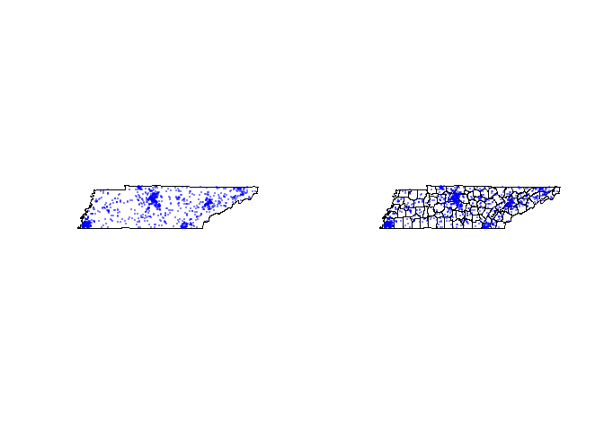

<!-- README.md is generated from README.Rmd. Please edit that file -->

# USPopulationSampler

<!-- badges: start -->
<!-- badges: end -->

The goal of USPopulationSampler is to sample the locations of people in
the United States according to 2020 Census data. Users can sample at a
state, county, tract, and block-group level.

## Installation

You can install the development version of USPopulationSampler from
[GitHub](https://github.com/) with:

``` r
# install.packages("devtools")
devtools::install_github("jasenzhang1/USPopulationSampler")
```

## Example

``` r
library(USPopulationSampler)
library(devtools)
#> Loading required package: usethis
load_all()
#> ℹ Loading USPopulationSampler
```

### If we are unsure of the names of the states, we first obtain a list of them

``` r
get_state_names()
#>  [1] "Alabama"              "Alaska"               "Arizona"             
#>  [4] "Arkansas"             "California"           "Colorado"            
#>  [7] "Connecticut"          "Delaware"             "District of Columbia"
#> [10] "Florida"              "Georgia"              "Hawaii"              
#> [13] "Idaho"                "Illinois"             "Indiana"             
#> [16] "Iowa"                 "Kansas"               "Kentucky"            
#> [19] "Louisiana"            "Maine"                "Maryland"            
#> [22] "Massachusetts"        "Michigan"             "Minnesota"           
#> [25] "Mississippi"          "Missouri"             "Montana"             
#> [28] "Nebraska"             "Nevada"               "New Hampshire"       
#> [31] "New Jersey"           "New Mexico"           "New York"            
#> [34] "North Carolina"       "North Dakota"         "Ohio"                
#> [37] "Oklahoma"             "Oregon"               "Pennsylvania"        
#> [40] "Rhode Island"         "South Carolina"       "South Dakota"        
#> [43] "Tennessee"            "Texas"                "Utah"                
#> [46] "Vermont"              "Virginia"             "Washington"          
#> [49] "West Virginia"        "Wisconsin"            "Wyoming"             
#> [52] "Puerto Rico"
```

### We’re interested in all the counties of Tennessee, so we get their county FIPS

``` r
tennessee_fips <- get_county_fips('Tennessee')
```

### Now we sample at the block-group level for the entire state of Tennessee

``` r
pts <- US_pop_sampler(N = 1000, tennessee_fips, level = 4)
```

### We prepare shape files of Tennessee as a state and its county borders

``` r
shape_state <- sampled_region_outline(tennessee_fips, 1)
shape_county <- sampled_region_outline(tennessee_fips, 2)
```

### And we plot our sampled points

``` r
ps <- 16
cs <- 0.3
alp <- 0.5

par(mfrow = c(1,2))

# plot 1: state border reference
plot(shape_state)
plot(pts, add = T, pch = ps, cex = cs,
       col = rgb(0, 0, 1, alpha = alp))

# plot 2: county border references
plot(shape_county)
plot(pts, add = T, pch = ps, cex = cs,
       col = rgb(0, 0, 1, alpha = alp))
```


